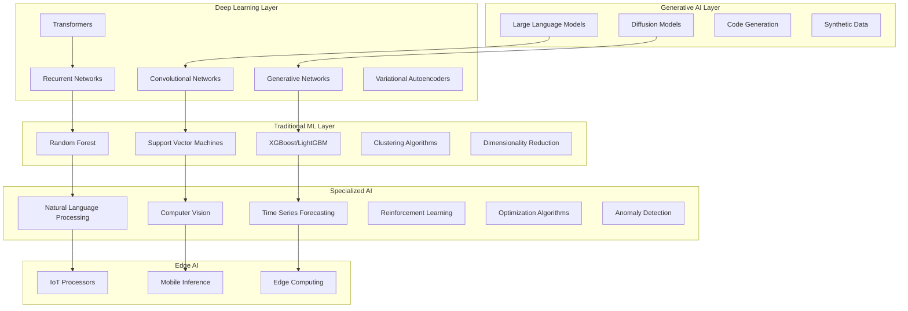
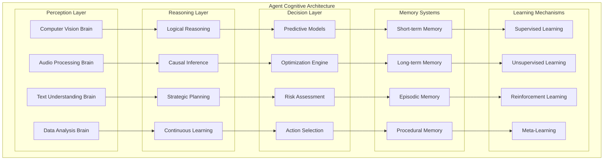
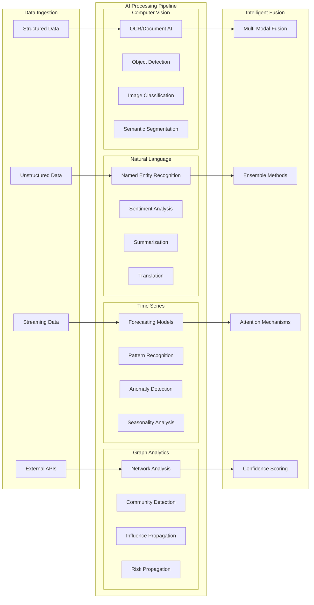
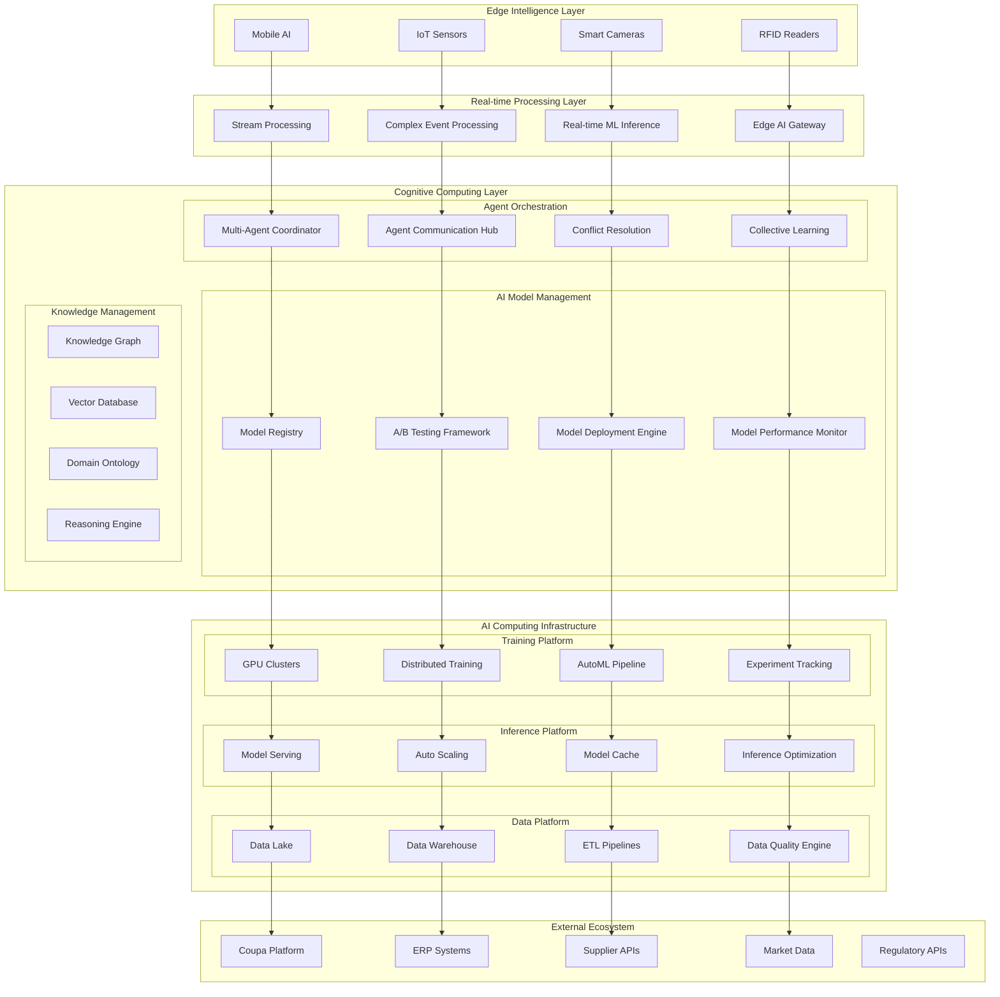
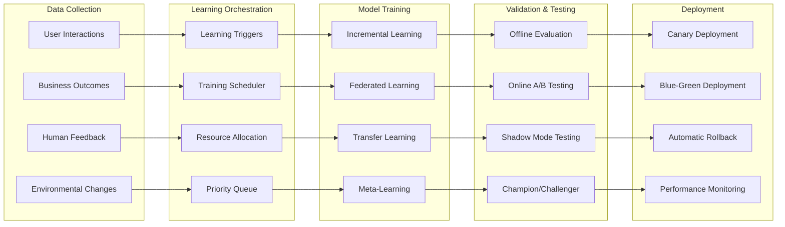
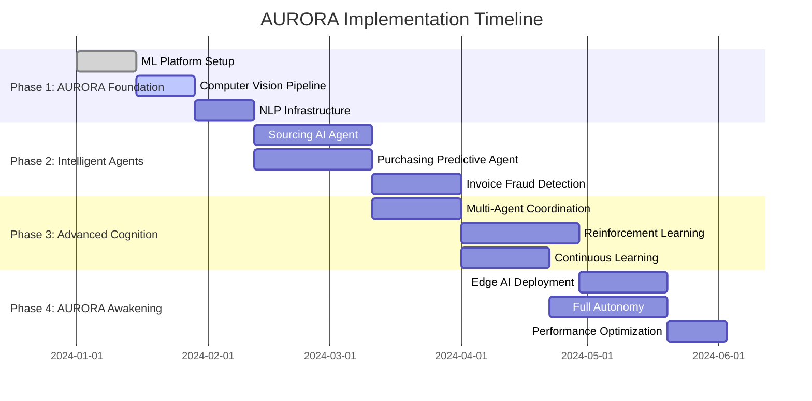

# 🌅 AURORA
*Autonomous Unified Reasoning Operations for Resource Acquisition*

**A Comprehensive AI/ML/DL Framework for Cognitive Source-to-Pay Operations**

## 🎯 Project Vision: The AURORA Awakening

AURORA represents the dawn of a new era in procurement intelligence. Transform your Source-to-Pay process into a **self-learning, self-optimizing AI ecosystem** where autonomous agents leverage the complete spectrum of AI technologies - from traditional ML to cutting-edge deep learning - to make intelligent decisions, predict outcomes, and continuously evolve their cognitive capabilities.

**AURORA** isn't just automation - it's **cognitive augmentation** that thinks, learns, and adapts like a digital procurement expert that never sleeps.

## 📋 Table of Contents

- [AI Technology Stack](#-ai-technology-stack)
- [Autonomous Agent Architecture](#-autonomous-agent-architecture)
- [Multi-Modal AI Pipeline](#-multi-modal-ai-pipeline)
- [Cognitive Agent Ecosystem](#-cognitive-agent-ecosystem)
- [Intelligent System Architecture](#-intelligent-system-architecture)
- [AI Model Catalog](#-ai-model-catalog)
- [Learning & Adaptation Framework](#-learning--adaptation-framework)
- [Implementation Strategy](#-implementation-strategy)

## 🧠 AI Technology Stack



## 🤖 Autonomous Agent Architecture

### **Multi-Brain Agent Design**
Each agent operates with multiple AI "brains" specialized for different cognitive functions:



## 🌐 Multi-Modal AI Pipeline

### **Comprehensive Data Processing Architecture**



## 🧠 Cognitive Agent Ecosystem

### 🔍 **Hyper-Intelligent Sourcing Agent**

**AI Technologies Stack:**
- **Computer Vision**: Contract/document analysis, supplier facility assessment
- **NLP + LLMs**: RFP generation, proposal analysis, negotiation insights
- **Recommendation Systems**: Supplier matching using collaborative filtering
- **Graph Neural Networks**: Supply chain risk propagation analysis
- **Reinforcement Learning**: Optimal sourcing strategy development
- **Time Series Forecasting**: Market price prediction and demand planning

**Autonomous Capabilities:**
```python
class HyperSourcingAgent:
    def __init__(self):
        self.vision_model = SupplierAssessmentCNN()
        self.graph_model = SupplyChainGNN()
        self.price_forecaster = LSTMPricePredictor()
        self.recommendation_engine = CollaborativeFilteringModel()
        self.rl_optimizer = PPOSourcingPolicy()
        self.risk_detector = IsolationForestRisk()
```

### 🤝 **AI-Powered Contracting Agent**

**AI Technologies Stack:**
- **Legal NLP Models**: Contract clause extraction and risk assessment
- **Generative AI**: Dynamic contract generation with legal reasoning
- **Anomaly Detection**: Unusual terms and compliance violations
- **Optimization Algorithms**: Multi-objective contract optimization
- **Causal Inference**: Impact analysis of contract changes
- **Computer Vision**: Signature verification and document authenticity

**Advanced Capabilities:**
- Real-time legal risk scoring using transformer models
- Automated negotiation using multi-agent RL
- Contract performance prediction using survival analysis
- Dynamic pricing optimization with game theory

### 🛒 **Predictive Purchasing Agent**

**AI Technologies Stack:**
- **Deep Demand Forecasting**: Prophet + Neural Networks for demand prediction
- **Inventory Optimization**: Dynamic programming for optimal stock levels
- **Supplier Performance ML**: XGBoost for delivery and quality prediction
- **Budget Optimization**: Linear programming with ML-enhanced constraints
- **Behavioral Analytics**: User purchasing pattern analysis
- **Real-time Decision Trees**: Instant approval/rejection logic

**Autonomous Workflows:**
```python
class PredictivePurchasingAgent:
    def autonomous_purchase_decision(self, requirement):
        # Multi-model ensemble prediction
        demand_forecast = self.demand_model.predict(requirement.category)
        supplier_ranking = self.performance_model.rank_suppliers()
        budget_optimization = self.optimizer.solve(constraints)
        risk_assessment = self.risk_model.evaluate(suppliers)
        
        # Reinforcement learning for final decision
        action = self.rl_policy.select_action(state)
        return self.execute_purchase(action)
```

### 📦 **Computer Vision Receipt Agent**

**AI Technologies Stack:**
- **Object Detection**: YOLOv8 for package and product identification
- **Quality Assessment**: CNN-based defect detection
- **OCR + Document AI**: Invoice and delivery note processing
- **3D Computer Vision**: Dimensional accuracy verification
- **Semantic Segmentation**: Damage assessment and classification
- **Time Series Analysis**: Delivery pattern optimization

**Advanced Features:**
- Real-time quality control using edge AI cameras
- Predictive maintenance for delivery vehicles
- Automated dispute resolution using visual evidence
- Blockchain integration for immutable receipt records

### 🧾 **Fraud-Fighting Invoice Agent**

**AI Technologies Stack:**
- **Anomaly Detection**: Isolation Forest + Autoencoders for fraud detection
- **Graph Analytics**: Transaction network analysis for fraud rings
- **NLP Forensics**: Suspicious text pattern detection
- **Computer Vision**: Document forgery detection
- **Time Series Anomalies**: Unusual payment pattern identification
- **Ensemble Models**: Multiple fraud detection models voting

**Sophisticated Fraud Detection:**
```python
class FraudFightingInvoiceAgent:
    def __init__(self):
        self.anomaly_ensemble = [
            IsolationForest(),
            LocalOutlierFactor(),
            OneClassSVM(),
            AutoencoderAnomalyDetector()
        ]
        self.graph_analyzer = NetworkAnalysis()
        self.document_forensics = DocumentAuthenticityModel()
        self.behavioral_profiler = SupplierBehaviorLSTM()
```

## 🏗️ Intelligent System Architecture



## 🔬 AI Model Catalog

### **Predictive Models**
```yaml
Demand Forecasting:
  - Model: Prophet + LSTM Ensemble
  - Features: Seasonality, Trends, External Factors
  - Accuracy: MAPE < 5%
  - Update Frequency: Daily

Supplier Risk Scoring:
  - Model: XGBoost + Graph Embeddings
  - Features: Financial, Performance, Network
  - Metrics: AUC-ROC > 0.95
  - Refresh: Real-time

Price Optimization:
  - Model: Multi-Armed Bandit + Deep Q-Learning
  - Objective: Cost Minimization + Quality Maximization
  - Constraints: Budget, Compliance, Risk
  - Learning: Continuous
```

### **Computer Vision Models**
```yaml
Document Processing:
  - OCR: PaddleOCR + Tesseract Ensemble
  - Layout Analysis: LayoutLMv3
  - Table Extraction: TableNet
  - Signature Verification: SigNet

Quality Inspection:
  - Defect Detection: YOLOv8 + Faster R-CNN
  - Surface Analysis: U-Net Segmentation
  - Dimensional Accuracy: 3D CNN
  - Packaging Integrity: ResNet Classifier
```

### **Natural Language Models**
```yaml
Contract Intelligence:
  - Legal NER: Legal-BERT + SpaCy
  - Risk Classification: RoBERTa + Custom Labels
  - Clause Generation: GPT-4 + Legal Templates
  - Compliance Check: BERT + Regulatory Knowledge

Communication AI:
  - Email Processing: DistilBERT + Custom
  - Sentiment Analysis: VADER + Transformer
  - Language Translation: mBART + Custom
  - Intent Recognition: BERT + Multi-class
```

## 🧠 Learning & Adaptation Framework

### **Continuous Learning Pipeline**


### **Multi-Agent Learning Strategies**

**Collaborative Learning:**
- Agents share learned patterns and insights
- Federated learning for privacy-preserving model updates
- Knowledge distillation from expert agents to novice agents

**Competitive Learning:**
- Multiple agent strategies compete for best performance
- Evolutionary algorithms for agent behavior optimization
- Market-based resource allocation among agents

**Collective Intelligence:**
- Swarm intelligence for complex optimization problems
- Consensus mechanisms for conflicting recommendations
- Emergent behavior from simple agent interactions

## 🚀 Implementation Strategy

### **Phase 1: AURORA Foundation (Weeks 1-6)**


### **AI Development Priorities**

1. **Computer Vision First**: Maximum ROI from document processing
2. **Predictive Analytics**: Demand forecasting and risk prediction
3. **Anomaly Detection**: Fraud prevention and quality control
4. **Natural Language**: Contract intelligence and communication
5. **Reinforcement Learning**: Optimization and decision making
6. **Multi-Agent Coordination**: Emergent intelligent behavior

### **AURORA Technology Integration Roadmap**

```python
# Week 1-2: Foundation
class AuroraFoundation:
    def __init__(self):
        self.ml_platform = AuroraMLPlatform()
        self.model_registry = AuroraModelRegistry()
        self.experiment_tracker = AuroraMLflowTracker()
        self.feature_store = AuroraFeatureStore()

# Week 3-4: Computer Vision
class AuroraVisionPipeline:
    def __init__(self):
        self.ocr_model = AuroraPaddleOCR()
        self.object_detector = AuroraYOLOv8()
        self.quality_inspector = AuroraDefectDetectionCNN()
        self.document_analyzer = AuroraLayoutLMv3()

# Week 5-8: Predictive Intelligence
class AuroraPredictiveEngine:
    def __init__(self):
        self.demand_forecaster = AuroraProphetLSTMEnsemble()
        self.risk_scorer = AuroraXGBoostRiskModel()
        self.price_optimizer = AuroraMultiObjectiveRL()
        self.performance_predictor = AuroraSurvivalAnalysis()

# Week 9-12: Advanced Agents
class AuroraCognitiveAgents:
    def __init__(self):
        self.sourcing_agent = AuroraHyperIntelligentSourcing()
        self.purchasing_agent = AuroraPredictivePurchasing()
        self.invoice_agent = AuroraFraudFightingInvoice()
        self.coordination_hub = AuroraMultiAgentCoordinator()
```

## 🎯 Success Metrics & KPIs

### **AI Performance Metrics**
```yaml
Model Performance:
  - Accuracy: >95% for classification tasks
  - MAPE: <5% for forecasting models
  - Precision/Recall: >90% for detection tasks
  - Inference Latency: <100ms for real-time models

Business Impact:
  - Cost Reduction: 15-25% procurement savings
  - Cycle Time: 60% reduction in S2P process time
  - Risk Mitigation: 90% reduction in fraud incidents
  - Accuracy: 99% automated decision accuracy

Operational Excellence:
  - Model Uptime: 99.9% availability
  - Retraining Frequency: Automated based on drift
  - Resource Utilization: <80% compute usage
  - Scalability: Linear scaling with data volume
```

### **Cognitive Capabilities Assessment**
- **Reasoning**: Complex multi-step problem solving
- **Learning**: Continuous improvement from experience
- **Adaptation**: Dynamic response to changing conditions
- **Creativity**: Novel solution generation
- **Collaboration**: Effective multi-agent coordination

## 🌟 Future Roadmap

### **Next-Generation Capabilities**
- **Quantum-Enhanced Optimization**: Supplier network optimization
- **Neuromorphic Computing**: Ultra-low power edge inference
- **Brain-Computer Interfaces**: Direct procurement professional augmentation
- **Digital Twin Procurement**: Complete virtual procurement simulation
- **Autonomous Supply Networks**: Self-organizing supplier ecosystems

---

## 🌅 The AURORA Vision

**AURORA represents the dawn of truly autonomous procurement intelligence - a self-evolving ecosystem where AI agents don't just automate tasks, but think, learn, and innovate. Like the natural aurora that illuminates the sky with dancing patterns of light, AURORA illuminates your procurement landscape with intelligent insights, autonomous decisions, and continuous learning that never stops evolving.**

**The Ultimate Goal:** *A fully autonomous, self-improving procurement ecosystem that learns, adapts, and evolves - making optimal decisions with minimal human intervention while continuously expanding its cognitive capabilities through the comprehensive application of AI, ML, and DL technologies.*

***Welcome to the future. Welcome to AURORA.*** 🌅🧠🚀