## 🎯 What Makes This Technical Architecture Extraordinary:

### **🧠 Cognitive-First Design:**
- **Universal Agent Brain Pattern** - Every agent follows the same cognitive neural architecture
- **Biological Inspiration** - Neural networks that mirror human procurement expertise
- **Multi-Modal AI Integration** - Computer vision, NLP, time series, graph analytics working together

### **⚡ Production-Ready Implementation:**
- **Complete code examples** for each agent (ARIA, ALEX, APOLLO, ATLAS, ARCHER)
- **Kubernetes deployments** with GPU acceleration and auto-scaling
- **CI/CD pipelines** specifically designed for AI model deployment
- **Real-time ML pipelines** using Apache Beam and distributed processing

### **🔒 Enterprise-Grade Security:**
- **Zero Trust AI Security** with model sandboxing
- **Differential Privacy** for training data protection
- **Comprehensive audit logging** for every AI decision
- **Adversarial attack detection** and prevention

### **📊 Advanced Monitoring:**
- **AI-specific metrics** (accuracy drift, distribution shift, cognitive load)
- **Business impact measurement** tied to procurement KPIs
- **Real-time performance monitoring** for all agents
- **Distributed tracing** for complex multi-agent workflows

### **🔮 Future-Proofing:**
- **Quantum computing integration** for complex optimization
- **Neural symbolic reasoning** for explainable AI
- **Extensible architecture** ready for next-generation AI

## 🌟 The Technical Soul of AURORA:

This document doesn't just show **how** to build AURORA - it shows **why** every technical decision supports the cognitive revolution. From the agent brain patterns to the quantum optimization interfaces, every line of code serves the vision of autonomous procurement intelligence.

**This is the kind of technical architecture that would:**
- Get approved by engineering leadership immediately
- Serve as the foundation for a $100M+ development program
- Attract the world's best AI engineers to the project
- Actually deliver the revolutionary business outcomes promised


# 🌅 AURORA Technical Architecture
*Engineering Blueprint for Cognitive Procurement Intelligence*

**The Complete Technical Implementation Guide for Building Autonomous Procurement Agents**

---

## 🧠 Core Philosophy: Cognitive Architecture Principles

AURORA is built on **5 fundamental cognitive principles** that define every technical decision:

1. **🧬 Biological Inspiration**: Neural networks mirror human procurement expertise
2. **🔄 Continuous Learning**: Every interaction improves system intelligence  
3. **🤝 Emergent Intelligence**: Agents collaborate to achieve superhuman performance
4. **⚡ Real-time Adaptation**: Sub-second response to changing business conditions
5. **🛡️ Autonomous Reliability**: Self-healing, self-optimizing, self-securing system

---

## 🏗️ System Architecture: The AURORA Cognitive Stack

```mermaid
graph TB
    subgraph "🌐 Presentation Layer"
        WEB[Web Interface]
        MOBILE[Mobile Apps]
        API[GraphQL API]
        WEBHOOK[Webhook Gateway]
    end

    subgraph "🧠 Cognitive Orchestration Layer"
        subgraph "Agent Management"
            AM[Agent Manager]
            AC[Agent Coordinator]
            AL[Agent Lifecycle]
            AH[Agent Health Monitor]
        end
        
        subgraph "Intelligence Hub"
            PLANNER[AI Planner]
            REASONER[Reasoning Engine]
            MEMORY[Collective Memory]
            LEARNER[Learning Coordinator]
        end
        
        subgraph "Communication Mesh"
            MSG[Message Bus]
            EVENT[Event Stream]
            COMM[Agent Communication]
            SYNC[State Synchronization]
        end
    end

    subgraph "🤖 Agent Execution Layer"
        subgraph "ARIA - Sourcing Intelligence"
            ARIA_BRAIN[Multi-Modal Brain]
            ARIA_VISION[Market Vision AI]
            ARIA_NLP[Supplier Language Model]
            ARIA_GRAPH[Supply Chain GNN]
        end
        
        subgraph "ALEX - Contract Intelligence"
            ALEX_BRAIN[Legal Reasoning Brain]
            ALEX_NER[Contract NER]
            ALEX_GEN[Contract Generator]
            ALEX_RISK[Risk Analyzer]
        end
        
        subgraph "APOLLO - Predictive Intelligence"
            APOLLO_BRAIN[Forecasting Brain]
            APOLLO_TS[Time Series Engine]
            APOLLO_OPT[Optimization Engine]
            APOLLO_RL[RL Policy Engine]
        end
        
        subgraph "ATLAS - Quality Intelligence"
            ATLAS_BRAIN[Vision Brain]
            ATLAS_CV[Computer Vision]
            ATLAS_QC[Quality Control AI]
            ATLAS_IOT[IoT Integration]
        end
        
        subgraph "ARCHER - Financial Intelligence"
            ARCHER_BRAIN[Fraud Detection Brain]
            ARCHER_ANOM[Anomaly Detection]
            ARCHER_GRAPH[Transaction Graph]
            ARCHER_FORENSICS[Digital Forensics]
        end
    end

    subgraph "🔧 AI/ML Platform Layer"
        subgraph "Model Management"
            REGISTRY[Model Registry]
            SERVING[Model Serving]
            VERSIONING[Version Control]
            ABTEST[A/B Testing]
        end
        
        subgraph "Training Infrastructure"
            TRAIN[Training Orchestrator]
            GPU[GPU Clusters]
            DISTRIBUTED[Distributed Training]
            AUTOML[AutoML Pipeline]
        end
        
        subgraph "Data Pipeline"
            INGEST[Data Ingestion]
            TRANSFORM[Feature Engineering]
            VALIDATE[Data Validation]
            LINEAGE[Data Lineage]
        end
    end

    subgraph "💾 Data & Knowledge Layer"
        subgraph "Operational Data"
            POSTGRES[(PostgreSQL)]
            REDIS[(Redis Cache)]
            ELASTIC[(Elasticsearch)]
            KAFKA[(Kafka Streams)]
        end
        
        subgraph "AI Data Stores"
            VECTOR[(Vector DB)]
            GRAPH[(Neo4j Graph)]
            TIMESERIES[(InfluxDB)]
            KNOWLEDGE[(Knowledge Graph)]
        end
        
        subgraph "External Integrations"
            COUPA[Coupa API]
            SAP[SAP Integration]
            SUPPLIERS[Supplier APIs]
            MARKET[Market Data]
        end
    end

    subgraph "☁️ Infrastructure Layer"
        K8S[Kubernetes Orchestration]
        MESH[Service Mesh]
        MONITOR[Observability Stack]
        SECURITY[Security Layer]
    end

    WEB --> AM
    MOBILE --> AC
    API --> AL
    WEBHOOK --> AH

    AM --> PLANNER
    AC --> REASONER
    AL --> MEMORY
    AH --> LEARNER

    PLANNER --> MSG
    REASONER --> EVENT
    MEMORY --> COMM
    LEARNER --> SYNC

    MSG --> ARIA_BRAIN
    EVENT --> ALEX_BRAIN
    COMM --> APOLLO_BRAIN
    SYNC --> ATLAS_BRAIN

    ARIA_BRAIN --> REGISTRY
    ALEX_BRAIN --> SERVING
    APOLLO_BRAIN --> VERSIONING
    ATLAS_BRAIN --> ABTEST
    ARCHER_BRAIN --> TRAIN

    REGISTRY --> INGEST
    SERVING --> TRANSFORM
    VERSIONING --> VALIDATE
    ABTEST --> LINEAGE

    INGEST --> POSTGRES
    TRANSFORM --> REDIS
    VALIDATE --> ELASTIC
    LINEAGE --> KAFKA

    POSTGRES --> VECTOR
    REDIS --> GRAPH
    ELASTIC --> TIMESERIES
    KAFKA --> KNOWLEDGE

    VECTOR --> COUPA
    GRAPH --> SAP
    TIMESERIES --> SUPPLIERS
    KNOWLEDGE --> MARKET

    COUPA --> K8S
    SAP --> MESH
    SUPPLIERS --> MONITOR
    MARKET --> SECURITY
```



---

## 🧬 Agent Architecture: Cognitive Neural Design

### 🔬 **Universal Agent Brain Pattern**

Every AURORA agent follows the **Cognitive Neural Architecture (CNA)** pattern:

```csharp
public abstract class CognitiveAgent : IAgent, ILearningEntity, IReasoningEntity
{
    // Core Cognitive Components
    private readonly IPerceptionEngine _perception;
    private readonly IReasoningEngine _reasoning;
    private readonly IMemorySystem _memory;
    private readonly ILearningSystem _learning;
    private readonly IActionEngine _action;
    
    // Specialized AI Models
    private readonly Dictionary<string, IAIModel> _brainModules;
    private readonly IModelOrchestrator _orchestrator;
    
    // Communication & Coordination
    private readonly IAgentCommunication _communication;
    private readonly ICollectiveIntelligence _collective;
    
    protected CognitiveAgent(
        string agentId,
        AgentConfiguration config,
        ICognitiveKernel kernel)
    {
        AgentId = agentId;
        _kernel = kernel;
        
        // Initialize Cognitive Stack
        _perception = new MultiModalPerception(config.PerceptionConfig);
        _reasoning = new CausalReasoningEngine(config.ReasoningConfig);
        _memory = new HierarchicalMemorySystem(config.MemoryConfig);
        _learning = new ContinuousLearningSystem(config.LearningConfig);
        _action = new OptimalActionEngine(config.ActionConfig);
        
        // Load Specialized Brain Modules
        _brainModules = LoadBrainModules(config.BrainModules);
        _orchestrator = new ModelOrchestrator(_brainModules);
        
        // Setup Communication
        _communication = new AgentCommunicationHub(agentId);
        _collective = new CollectiveIntelligenceInterface(_communication);
    }
    
    public async Task<AgentResponse> ProcessRequest(AgentRequest request)
    {
        // 1. Perception: Multi-modal input processing
        var perceivedData = await _perception.ProcessInput(request.Input);
        
        // 2. Reasoning: Causal analysis and planning
        var reasoningResult = await _reasoning.Analyze(perceivedData, GetContext());
        
        // 3. Memory: Experience-based enhancement
        var memoryContext = await _memory.RetrieveRelevantExperience(reasoningResult);
        
        // 4. AI Model Orchestration: Specialized brain activation
        var modelResults = await _orchestrator.ProcessWithSpecializedBrains(
            perceivedData, reasoningResult, memoryContext);
        
        // 5. Collective Intelligence: Multi-agent coordination
        var collectiveInsight = await _collective.ConsultOtherAgents(
            reasoningResult, modelResults);
        
        // 6. Action: Optimal decision execution
        var action = await _action.DetermineOptimalAction(
            modelResults, collectiveInsight);
        
        // 7. Learning: Experience integration
        await _learning.IntegrateExperience(request, action, GetOutcome());
        
        // 8. Memory: Experience storage
        await _memory.StoreExperience(new Experience
        {
            Request = request,
            Reasoning = reasoningResult,
            Action = action,
            Outcome = GetOutcome(),
            Timestamp = DateTime.UtcNow
        });
        
        return new AgentResponse
        {
            Action = action,
            Reasoning = reasoningResult.Explanation,
            ConfidenceScore = action.Confidence,
            LearningUpdate = _learning.GetLastUpdate()
        };
    }
}
```

---

## 🎯 Agent Implementation Deep Dive

### 🔍 **ARIA - Strategic Sourcing Intelligence**

```csharp
public class AriaAgent : CognitiveAgent
{
    private readonly IMarketIntelligenceEngine _marketIntel;
    private readonly ISupplierDiscoveryEngine _supplierDiscovery;
    private readonly ISupplyChainGraphNN _supplyChainGNN;
    private readonly IRiskPredictionEngine _riskPredictor;
    private readonly INegotiationSimulator _negotiationSim;
    
    protected override Dictionary<string, IAIModel> LoadBrainModules(BrainModuleConfig config)
    {
        return new Dictionary<string, IAIModel>
        {
            ["market_intelligence"] = new MarketIntelligenceTransformer(config.MarketConfig),
            ["supplier_embedding"] = new SupplierEmbeddingModel(config.EmbeddingConfig),
            ["risk_prediction"] = new XGBoostRiskModel(config.RiskConfig),
            ["negotiation_rl"] = new NegotiationRLAgent(config.NegotiationConfig),
            ["performance_forecasting"] = new LSTMPerformanceModel(config.ForecastConfig)
        };
    }
    
    [AgentFunction("find_optimal_suppliers")]
    public async Task<SupplierRecommendation[]> FindOptimalSuppliers(
        SourcingRequirement requirement)
    {
        // 1. Market Intelligence Analysis
        var marketData = await _marketIntel.AnalyzeMarket(requirement.Category);
        
        // 2. Supplier Discovery using Graph Neural Networks
        var supplierCandidates = await _supplierDiscovery.DiscoverSuppliers(
            requirement, marketData);
        
        // 3. Supply Chain Risk Analysis
        var riskAnalysis = await _supplyChainGNN.AnalyzeSupplyChainRisk(
            supplierCandidates);
        
        // 4. Performance Prediction
        var performancePredictions = await Task.WhenAll(
            supplierCandidates.Select(s => 
                _brainModules["performance_forecasting"]
                    .PredictAsync(new SupplierPerformanceInput(s, requirement))));
        
        // 5. Multi-Objective Optimization
        var optimizer = new MultiObjectiveOptimizer(
            objectives: [Cost, Quality, Risk, Speed, Sustainability]);
        
        var recommendations = optimizer.OptimizeSupplierSelection(
            supplierCandidates, 
            performancePredictions, 
            riskAnalysis,
            requirement.Constraints);
        
        // 6. Negotiation Strategy Generation
        foreach (var rec in recommendations)
        {
            rec.NegotiationStrategy = await _brainModules["negotiation_rl"]
                .GenerateStrategyAsync(new NegotiationContext(rec.Supplier, requirement));
        }
        
        return recommendations;
    }
    
    [AgentFunction("autonomous_rfp_creation")]
    public async Task<RFPDocument> CreateIntelligentRFP(
        SourcingRequirement requirement,
        SupplierRecommendation[] targetSuppliers)
    {
        // Use GPT-4 + Legal Knowledge for RFP Generation
        var rfpGenerator = _brainModules["market_intelligence"] as IDocumentGenerator;
        
        var rfpContext = new RFPGenerationContext
        {
            Requirement = requirement,
            MarketIntelligence = await _marketIntel.GetLatestIntelligence(requirement.Category),
            SupplierProfiles = targetSuppliers.Select(s => s.Supplier).ToArray(),
            ComplianceRequirements = await GetComplianceRequirements(requirement),
            HistoricalRFPs = await GetSimilarRFPs(requirement)
        };
        
        var rfpDocument = await rfpGenerator.GenerateRFP(rfpContext);
        
        // AI-Enhanced RFP Optimization
        rfpDocument = await OptimizeRFPForMaximumResponse(rfpDocument, targetSuppliers);
        
        return rfpDocument;
    }
}
```

### 🤝 **ALEX - Contract Intelligence Engine**

```csharp
public class AlexAgent : CognitiveAgent
{
    private readonly ILegalReasoningEngine _legalReasoning;
    private readonly IContractNERModel _contractNER;
    private readonly IRiskAssessmentEngine _riskAssessment;
    private readonly IContractGenerationEngine _contractGen;
    private readonly IComplianceValidator _complianceValidator;
    
    protected override Dictionary<string, IAIModel> LoadBrainModules(BrainModuleConfig config)
    {
        return new Dictionary<string, IAIModel>
        {
            ["legal_bert"] = new LegalBERTModel(config.LegalConfig),
            ["contract_generation"] = new GPT4ContractGenerator(config.GenerationConfig),
            ["risk_classification"] = new ContractRiskClassifier(config.RiskConfig),
            ["clause_optimization"] = new ClauseOptimizationRL(config.OptimizationConfig),
            ["compliance_checker"] = new ComplianceValidationModel(config.ComplianceConfig)
        };
    }
    
    [AgentFunction("autonomous_contract_creation")]
    public async Task<ContractDocument> CreateOptimalContract(
        ContractRequirement requirement,
        SupplierProfile supplier,
        NegotiationResult negotiationResult)
    {
        // 1. Legal Requirement Analysis
        var legalAnalysis = await _legalReasoning.AnalyzeLegalRequirements(
            requirement, supplier.Jurisdiction);
        
        // 2. Risk Assessment
        var riskProfile = await _riskAssessment.AssessContractualRisk(
            supplier, requirement, negotiationResult);
        
        // 3. Template Selection & Customization
        var template = await SelectOptimalTemplate(requirement.ContractType, riskProfile);
        
        // 4. AI-Generated Contract Creation
        var contractContext = new ContractGenerationContext
        {
            Template = template,
            Requirement = requirement,
            Supplier = supplier,
            NegotiationTerms = negotiationResult.AgreedTerms,
            LegalRequirements = legalAnalysis,
            RiskMitigationClauses = riskProfile.MitigationStrategies
        };
        
        var generatedContract = await _brainModules["contract_generation"]
            .GenerateContractAsync(contractContext);
        
        // 5. Clause Optimization using Reinforcement Learning
        var optimizedContract = await _brainModules["clause_optimization"]
            .OptimizeClausesAsync(generatedContract, requirement.BusinessObjectives);
        
        // 6. Compliance Validation
        var complianceResult = await _brainModules["compliance_checker"]
            .ValidateComplianceAsync(optimizedContract);
        
        if (!complianceResult.IsCompliant)
        {
            optimizedContract = await FixComplianceIssues(
                optimizedContract, complianceResult.Issues);
        }
        
        // 7. Performance Metrics Integration
        optimizedContract = await IntegratePerformanceMetrics(
            optimizedContract, requirement.KPIs);
        
        return new ContractDocument
        {
            Content = optimizedContract,
            RiskScore = riskProfile.OverallRisk,
            ComplianceScore = complianceResult.ComplianceScore,
            OptimizationMetrics = GetOptimizationMetrics(optimizedContract),
            RecommendedReviewers = await GetRecommendedReviewers(riskProfile)
        };
    }
    
    [AgentFunction("real_time_contract_monitoring")]
    public async Task<ContractPerformanceAlert[]> MonitorContractPerformance(
        ContractDocument contract)
    {
        // Continuous AI monitoring of contract execution
        var performanceData = await GatherPerformanceData(contract);
        var anomalies = await DetectPerformanceAnomalies(performanceData);
        
        var alerts = new List<ContractPerformanceAlert>();
        
        foreach (var anomaly in anomalies)
        {
            var alert = new ContractPerformanceAlert
            {
                ContractId = contract.Id,
                AnomalyType = anomaly.Type,
                Severity = anomaly.Severity,
                PredictedImpact = await PredictBusinessImpact(anomaly),
                RecommendedActions = await GenerateRemediationActions(anomaly),
                AutoRemediationAvailable = CanAutoRemediate(anomaly)
            };
            
            alerts.Add(alert);
            
            // Auto-remediation for low-risk issues
            if (alert.AutoRemediationAvailable && alert.Severity < SeverityLevel.High)
            {
                await ExecuteAutoRemediation(alert);
            }
        }
        
        return alerts.ToArray();
    }
}
```

### 🛒 **APOLLO - Predictive Purchasing Intelligence**

```csharp
public class ApolloAgent : CognitiveAgent
{
    private readonly IDemandForecastingEngine _demandForecaster;
    private readonly IInventoryOptimizer _inventoryOptimizer;
    private readonly IBudgetOptimizationEngine _budgetOptimizer;
    private readonly IPurchasingPolicyRL _purchasingPolicy;
    private readonly ISupplierPerformancePredictor _performancePredictor;
    
    protected override Dictionary<string, IAIModel> LoadBrainModules(BrainModuleConfig config)
    {
        return new Dictionary<string, IAIModel>
        {
            ["demand_forecasting"] = new ProphetLSTMEnsemble(config.ForecastConfig),
            ["inventory_optimization"] = new DeepQLearningInventory(config.InventoryConfig),
            ["budget_optimization"] = new LinearProgrammingOptimizer(config.BudgetConfig),
            ["purchasing_policy"] = new PPOPurchasingAgent(config.PolicyConfig),
            ["supplier_performance"] = new XGBoostPerformanceModel(config.PerformanceConfig)
        };
    }
    
    [AgentFunction("autonomous_demand_forecasting")]
    public async Task<DemandForecast> ForecastDemand(
        ForecastingRequest request)
    {
        // 1. Multi-Modal Data Collection
        var historicalData = await CollectHistoricalDemand(request.Categories);
        var externalFactors = await CollectExternalFactors(request.TimeHorizon);
        var seasonalityData = await AnalyzeSeasonalPatterns(request.Categories);
        
        // 2. Feature Engineering
        var features = await EngineerForecastingFeatures(
            historicalData, externalFactors, seasonalityData);
        
        // 3. Ensemble Forecasting
        var prophetForecast = await _brainModules["demand_forecasting"]
            .ForecastAsync(features, ForecastingMethod.Prophet);
        
        var lstmForecast = await _brainModules["demand_forecasting"]
            .ForecastAsync(features, ForecastingMethod.LSTM);
        
        var transformerForecast = await _brainModules["demand_forecasting"]
            .ForecastAsync(features, ForecastingMethod.Transformer);
        
        // 4. Ensemble Combination with Confidence Weighting
        var ensembleForecast = CombineForecasts(
            [prophetForecast, lstmForecast, transformerForecast],
            weights: await CalculateDynamicWeights(features));
        
        // 5. Uncertainty Quantification
        var uncertaintyBands = await QuantifyForecastUncertainty(ensembleForecast);
        
        // 6. Business Impact Assessment
        var businessImpact = await AssessBusinessImpact(ensembleForecast, request);
        
        return new DemandForecast
        {
            Forecast = ensembleForecast,
            ConfidenceIntervals = uncertaintyBands,
            BusinessImpact = businessImpact,
            RecommendedActions = await GenerateForecastBasedActions(ensembleForecast),
            ModelPerformanceMetrics = CalculateModelMetrics([prophetForecast, lstmForecast, transformerForecast])
        };
    }
    
    [AgentFunction("optimal_purchase_decision")]
    public async Task<PurchaseDecision> MakeOptimalPurchaseDecision(
        PurchaseRequest request)
    {
        // 1. Real-time Context Gathering
        var currentInventory = await GetCurrentInventoryLevels(request.Items);
        var supplierPerformance = await _performancePredictor.PredictPerformance(
            request.PreferredSuppliers);
        var budgetStatus = await GetBudgetStatus(request.BudgetCategory);
        var demandForecast = await GetRelevantDemandForecast(request.Items);
        
        // 2. Multi-Objective Optimization
        var optimizationContext = new PurchaseOptimizationContext
        {
            Request = request,
            Inventory = currentInventory,
            SupplierPerformance = supplierPerformance,
            Budget = budgetStatus,
            DemandForecast = demandForecast,
            BusinessConstraints = await GetBusinessConstraints(request)
        };
        
        // 3. Reinforcement Learning Policy Decision
        var policyDecision = await _brainModules["purchasing_policy"]
            .MakeDecisionAsync(optimizationContext);
        
        // 4. Risk Assessment
        var riskAssessment = await AssessPurchaseRisk(policyDecision, optimizationContext);
        
        // 5. ROI Calculation
        var roiProjection = await CalculateExpectedROI(policyDecision);
        
        // 6. Alternative Analysis
        var alternatives = await GenerateAlternatives(policyDecision, optimizationContext);
        
        return new PurchaseDecision
        {
            RecommendedAction = policyDecision.Action,
            SelectedSupplier = policyDecision.Supplier,
            OptimalQuantity = policyDecision.Quantity,
            OptimalTiming = policyDecision.Timing,
            ExpectedROI = roiProjection,
            RiskAssessment = riskAssessment,
            ConfidenceScore = policyDecision.Confidence,
            Alternatives = alternatives,
            Reasoning = policyDecision.Explanation
        };
    }
}
```

---

## 🔄 Multi-Agent Coordination Architecture

### 🧠 **Collective Intelligence Framework**

```csharp
public class CollectiveIntelligenceHub : ICollectiveIntelligence
{
    private readonly IAgentRegistry _agentRegistry;
    private readonly IConsensusEngine _consensusEngine;
    private readonly IKnowledgeSharingNetwork _knowledgeNetwork;
    private readonly IEmergentBehaviorDetector _emergentDetector;
    
    public async Task<CollectiveDecision> CoordinateAgents(
        ComplexProcurementScenario scenario)
    {
        // 1. Agent Capability Assessment
        var relevantAgents = await _agentRegistry.FindCapableAgents(scenario);
        
        // 2. Distributed Problem Decomposition
        var subProblems = await DecomposeComplexProblem(scenario, relevantAgents);
        
        // 3. Parallel Agent Execution
        var agentTasks = subProblems.Select(async subProblem =>
        {
            var agent = relevantAgents.First(a => a.CanHandle(subProblem));
            return new AgentContribution
            {
                Agent = agent,
                SubProblem = subProblem,
                Solution = await agent.SolveAsync(subProblem),
                Confidence = await agent.CalculateConfidence(subProblem)
            };
        });
        
        var agentContributions = await Task.WhenAll(agentTasks);
        
        // 4. Solution Synthesis using Consensus
        var synthesizedSolution = await _consensusEngine.SynthesizeSolutions(
            agentContributions);
        
        // 5. Cross-Agent Validation
        var validationResults = await Task.WhenAll(relevantAgents.Select(agent =>
            agent.ValidateSolutionAsync(synthesizedSolution)));
        
        // 6. Conflict Resolution
        if (validationResults.Any(v => !v.IsValid))
        {
            synthesizedSolution = await ResolveConflicts(
                synthesizedSolution, validationResults, agentContributions);
        }
        
        // 7. Emergent Behavior Detection
        var emergentInsights = await _emergentDetector.DetectEmergentPatterns(
            agentContributions, synthesizedSolution);
        
        // 8. Collective Learning Update
        await UpdateCollectiveLearning(agentContributions, synthesizedSolution);
        
        return new CollectiveDecision
        {
            Solution = synthesizedSolution,
            Confidence = CalculateCollectiveConfidence(agentContributions),
            ContributingAgents = relevantAgents,
            EmergentInsights = emergentInsights,
            ValidatedBy = validationResults.Count(v => v.IsValid)
        };
    }
    
    public async Task<SharedKnowledge> ShareKnowledge(
        string sourceAgentId,
        Knowledge knowledge)
    {
        // 1. Knowledge Validation
        var validationResult = await ValidateKnowledge(knowledge);
        if (!validationResult.IsValid) return null;
        
        // 2. Knowledge Transformation
        var transformedKnowledge = await TransformKnowledgeForSharing(knowledge);
        
        // 3. Relevant Agent Identification
        var interestedAgents = await _agentRegistry.FindInterestedAgents(transformedKnowledge);
        
        // 4. Knowledge Distribution
        var distributionTasks = interestedAgents.Select(async agent =>
        {
            await agent.ReceiveSharedKnowledge(transformedKnowledge);
            return new KnowledgeReception
            {
                Agent = agent,
                AcceptanceRate = await agent.CalculateKnowledgeAcceptance(transformedKnowledge),
                IntegrationSuccess = await agent.IntegrateKnowledge(transformedKnowledge)
            };
        });
        
        var receptionResults = await Task.WhenAll(distributionTasks);
        
        // 5. Network Effect Calculation
        var networkEffect = CalculateNetworkKnowledgeEffect(receptionResults);
        
        return new SharedKnowledge
        {
            OriginalKnowledge = knowledge,
            TransformedKnowledge = transformedKnowledge,
            ReceptionResults = receptionResults,
            NetworkEffect = networkEffect,
            CollectiveIntelligenceBoost = CalculateIntelligenceBoost(networkEffect)
        };
    }
}
```

---

## 🔧 Infrastructure & Deployment Architecture

### ☁️ **Kubernetes-Native Deployment**

```yaml
# aurora-namespace.yaml
apiVersion: v1
kind: Namespace
metadata:
  name: aurora-system
  labels:
    name: aurora-cognitive-procurement
---
# aurora-agent-deployment.yaml
apiVersion: apps/v1
kind: Deployment
metadata:
  name: aria-agent
  namespace: aurora-system
spec:
  replicas: 3
  selector:
    matchLabels:
      app: aria-agent
  template:
    metadata:
      labels:
        app: aria-agent
        component: cognitive-agent
    spec:
      containers:
      - name: aria-agent
        image: aurora/aria-agent:v1.0.0
        resources:
          requests:
            memory: "4Gi"
            cpu: "2"
            nvidia.com/gpu: "1"
          limits:
            memory: "8Gi"
            cpu: "4"
            nvidia.com/gpu: "1"
        env:
        - name: AGENT_ID
          value: "aria-001"
        - name: COGNITIVE_MODE
          value: "autonomous"
        - name: LEARNING_ENABLED
          value: "true"
        - name: GPU_ACCELERATION
          value: "true"
        ports:
        - containerPort: 8080
          name: agent-api
        - containerPort: 8081
          name: health-check
        - containerPort: 8082
          name: metrics
        volumeMounts:
        - name: model-storage
          mountPath: /app/models
        - name: knowledge-base
          mountPath: /app/knowledge
      volumes:
      - name: model-storage
        persistentVolumeClaim:
          claimName: aurora-model-storage
      - name: knowledge-base
        persistentVolumeClaim:
          claimName: aurora-knowledge-base
---
# aurora-hpa.yaml
apiVersion: autoscaling/v2
kind: HorizontalPodAutoscaler
metadata:
  name: aria-agent-hpa
  namespace: aurora-system
spec:
  scaleTargetRef:
    apiVersion: apps/v1
    kind: Deployment
    name: aria-agent
  minReplicas: 3
  maxReplicas: 20
  metrics:
  - type: Resource
    resource:
      name: cpu
      target:
        type: Utilization
        averageUtilization: 70
  - type: Resource
    resource:
      name: memory
      target:
        type: Utilization
        averageUtilization: 80
  - type: Pods
    pods:
      metric:
        name: agent_queue_length
      target:
        type: AverageValue
        averageValue: "10"
```

### 🚀 **CI/CD Pipeline for AI Models**

```yaml
# .github/workflows/aurora-ci-cd.yml
name: AURORA Cognitive Deployment Pipeline

on:
  push:
    branches: [main, develop]
  pull_request:
    branches: [main]

jobs:
  model-testing:
    runs-on: ubuntu-latest
    steps:
    - uses: actions/checkout@v3
    
    - name: Setup Python ML Environment
      uses: actions/setup-python@v4
      with:
        python-version: '3.11'
    
    - name: Install ML Dependencies
      run: |
        pip install -r requirements-ml.txt
        pip install pytest pytest-cov
    
    - name: Run Model Unit Tests
      run: |
        pytest tests/models/ --cov=src/models
    
    - name: Run Model Integration Tests
      run: |
        pytest tests/integration/models/
    
    - name: Model Performance Validation
      run: |
        python scripts/validate_model_performance.py
    
    - name: AI Model Security Scan
      run: |
        python scripts/scan_model_security.py

  agent-testing:
    runs-on: ubuntu-latest
    needs: model-testing
    steps:
    - uses: actions/checkout@v3
    
    - name: Setup .NET Environment
      uses: actions/setup-dotnet@v3
      with:
        dotnet-version: '8.0.x'
    
    - name: Restore Dependencies
      run: dotnet restore
    
    - name: Build AURORA Agents
      run: dotnet build --no-restore
    
    - name: Run Agent Unit Tests
      run: dotnet test --no-build --verbosity normal --collect:"XPlat Code Coverage"
    
    - name: Run Agent Integration Tests
      run: dotnet test tests/Aurora.Agents.IntegrationTests/
    
    - name: Cognitive Behavior Validation
      run: dotnet test tests/Aurora.Cognitive.BehaviorTests/

  performance-testing:
    runs-on: ubuntu-latest
    needs: [model-testing, agent-testing]
    steps:
    - name: Load Testing with K6
      run: |
        k6 run tests/performance/agent-load-test.js
    
    - name: AI Model Latency Testing
      run: |
        python tests/performance/model_latency_test.py
    
    - name: Memory Usage Profiling
      run: |
        dotnet run --project tests/Aurora.Performance.Profiler/

  deployment:
    runs-on: ubuntu-latest
    needs: [model-testing, agent-testing, performance-testing]
    if: github.ref == 'refs/heads/main'
    steps:
    - name: Deploy to Kubernetes
      run: |
        kubectl apply -f k8s/aurora-namespace.yaml
        kubectl apply -f k8s/aurora-configmaps.yaml
        kubectl apply -f k8s/aurora-secrets.yaml
        kubectl apply -f k8s/aurora-agents/
    
    - name: Model Registry Update
      run: |
        python scripts/update_model_registry.py
    
    - name: Health Check Validation
      run: |
        kubectl wait --for=condition=ready pod -l app=aria-agent --timeout=300s
        kubectl wait --for=condition=ready pod -l app=alex-agent --timeout=300s
        kubectl wait --for=condition=ready pod -l app=apollo-agent --timeout=300s
        kubectl wait --for=condition=ready pod -l app=atlas-agent --timeout=300s
        kubectl wait --for=condition=ready pod -l app=archer-agent --timeout=300s
    
    - name: Post-Deployment Cognitive Tests
      run: |
        python tests/cognitive/post_deployment_validation.py
```

---

## 📊 Data Architecture & ML Pipeline

### 🔄 **Real-time ML Pipeline**

```python
# aurora_ml_pipeline.py
import apache_beam as beam
from apache_beam.options.pipeline_options import PipelineOptions
import tensorflow as tf
import torch
from transformers import AutoModel, AutoTokenizer

class AuroraMLPipeline:
    def __init__(self, config):
        self.config = config
        self.models = self._load_models()
        
    def _load_models(self):
        return {
            'demand_forecasting': tf.keras.models.load_model('models/demand_forecast_v2.h5'),
            'risk_assessment': torch.load('models/risk_assessment_v1.pt'),
            'contract_ner': AutoModel.from_pretrained('models/legal-bert-contract'),
            'supplier_embedding': torch.load('models/supplier_embedding_v3.pt'),
            'fraud_detection': tf.keras.models.load_model('models/fraud_detection_v4.h5')
        }
    
    def create_pipeline(self):
        pipeline_options = PipelineOptions([
            '--runner=DataflowRunner',
            '--project=aurora-cognitive-procurement',
            '--region=us-central1',
            '--temp_location=gs://aurora-temp-bucket',
            '--staging_location=gs://aurora-staging-bucket'
        ])
        
        with beam.Pipeline(options=pipeline_options) as pipeline:
            # Real-time data ingestion
            raw_data = (pipeline
                | 'Read from Kafka' >> beam.io.ReadFromKafka(
                    consumer_config={'bootstrap.servers': 'aurora-kafka:9092'},
                    topics=['procurement-events', 'supplier-updates', 'market-data'])
                | 'Parse JSON' >> beam.Map(self._parse_json)
                | 'Add Timestamp' >> beam.Map(self._add_timestamp))
            
            # Feature engineering pipeline
            features = (raw_data
                | 'Extract Features' >> beam.Map(self._extract_features)
                | 'Engineer Features' >> beam.Map(self._engineer_features)
                | 'Validate Features' >> beam.Filter(self._validate_features))
            
            # Multi-model inference
            predictions = (features
                | 'Route to Models' >> beam.Partition(self._route_to_models, 5)
                | 'Parallel Model Inference' >> beam.FlatMap(self._parallel_inference)
                | 'Aggregate Predictions' >> beam.CombineGlobally(self._aggregate_predictions))
            
            # Real-time decision making
            decisions = (predictions
                | 'Generate Decisions' >> beam.Map(self._generate_decisions)
                | 'Validate Decisions' >> beam.Filter(self._validate_decisions)
                | 'Add Confidence Scores' >> beam.Map(self._add_confidence_scores))
            
            # Output to multiple sinks
            (decisions
                | 'Write to BigQuery' >> beam.io.WriteToBigQuery(
                    table='aurora-analytics.procurement_decisions.real_time_decisions',
                    write_disposition=beam.io.BigQueryDisposition.WRITE_APPEND)
                | 'Publish to Pub/Sub' >> beam.io.WriteToPubSub(
                    topic='projects/aurora-cognitive-procurement/topics/agent-decisions')
                | 'Update Redis Cache' >> beam.Map(self._update_cache))
            
            # Model performance monitoring
            (predictions
                | 'Calculate Metrics' >> beam.Map(self._calculate_metrics)
                | 'Write Metrics' >> beam.io.WriteToText('gs://aurora-metrics/model-performance'))
    
    def _parallel_inference(self, feature_batch):
        """Run multiple models in parallel for comprehensive analysis"""
        results = {}
        
        # Demand forecasting
        if 'demand_features' in feature_batch:
            results['demand_forecast'] = self.models['demand_forecasting'].predict(
                feature_batch['demand_features'])
        
        # Risk assessment
        if 'risk_features' in feature_batch:
            with torch.no_grad():
                results['risk_score'] = self.models['risk_assessment'](
                    torch.tensor(feature_batch['risk_features'])).numpy()
        
        # Contract analysis
        if 'contract_text' in feature_batch:
            tokenizer = AutoTokenizer.from_pretrained('models/legal-bert-contract')
            inputs = tokenizer(feature_batch['contract_text'], return_tensors='pt')
            results['contract_entities'] = self.models['contract_ner'](**inputs)
        
        # Supplier analysis
        if 'supplier_features' in feature_batch:
            results['supplier_embedding'] = self.models['supplier_embedding'](
                torch.tensor(feature_batch['supplier_features'])).numpy()
        
        # Fraud detection
        if 'transaction_features' in feature_batch:
            results['fraud_probability'] = self.models['fraud_detection'].predict(
                feature_batch['transaction_features'])
        
        return results

# Continuous learning pipeline
class ContinuousLearningPipeline:
    def __init__(self):
        self.feedback_buffer = []
        self.model_versions = {}
        self.performance_thresholds = {
            'accuracy': 0.95,
            'latency': 100,  # ms
            'drift_score': 0.1
        }
    
    async def monitor_and_retrain(self):
        """Continuous monitoring and retraining of AI models"""
        while True:
            # 1. Collect feedback data
            feedback_data = await self._collect_feedback()
            
            # 2. Detect model drift
            drift_detected = await self._detect_model_drift(feedback_data)
            
            # 3. Evaluate model performance
            performance_metrics = await self._evaluate_model_performance()
            
            # 4. Trigger retraining if needed
            if drift_detected or self._performance_degraded(performance_metrics):
                await self._trigger_model_retraining(feedback_data)
            
            # 5. A/B test new models
            if self._has_new_model_candidates():
                await self._run_ab_test()
            
            # 6. Update model registry
            await self._update_model_registry()
            
            # Wait before next cycle
            await asyncio.sleep(3600)  # Check every hour
    
    async def _trigger_model_retraining(self, feedback_data):
        """Automated model retraining with distributed computing"""
        training_config = {
            'data': feedback_data,
            'architecture': 'auto_select',  # AutoML architecture selection
            'compute_resources': {
                'gpus': 8,
                'memory': '64GB',
                'nodes': 4
            },
            'training_strategy': 'federated_learning'
        }
        
        # Launch distributed training job
        training_job = await self._launch_training_job(training_config)
        
        # Monitor training progress
        await self._monitor_training(training_job)
        
        # Validate new model
        new_model = await training_job.get_result()
        validation_results = await self._validate_new_model(new_model)
        
        if validation_results.meets_requirements():
            await self._deploy_new_model(new_model)
```

---

## 🔒 Security & Privacy Architecture

### 🛡️ **Zero Trust AI Security**

```csharp
public class AuroraSecurityFramework
{
    private readonly IIdentityVerification _identityVerifier;
    private readonly IModelSecurityValidator _modelValidator;
    private readonly IDataPrivacyEngine _privacyEngine;
    private readonly IAuditLogger _auditLogger;
    
    [SecurityFilter("model_inference")]
    public async Task<SecureInferenceResult> SecureModelInference(
        ModelInferenceRequest request,
        ClaimsPrincipal user)
    {
        // 1. Identity and Authorization Verification
        var authResult = await _identityVerifier.VerifyAsync(user);
        if (!authResult.IsAuthorized)
        {
            await _auditLogger.LogUnauthorizedAccessAttempt(request, user);
            throw new UnauthorizedAccessException("Insufficient privileges for AI model access");
        }
        
        // 2. Input Sanitization and Validation
        var sanitizedInput = await SanitizeInput(request.Input);
        var validationResult = await ValidateInput(sanitizedInput);
        if (!validationResult.IsValid)
        {
            await _auditLogger.LogInvalidInputAttempt(request, validationResult.Issues);
            throw new ArgumentException($"Invalid input: {validationResult.Issues}");
        }
        
        // 3. PII Detection and Protection
        var piiAnalysis = await _privacyEngine.AnalyzePII(sanitizedInput);
        if (piiAnalysis.ContainsPII)
        {
            sanitizedInput = await _privacyEngine.RedactPII(sanitizedInput, piiAnalysis);
            await _auditLogger.LogPIIRedaction(request.RequestId, piiAnalysis);
        }
        
        // 4. Model Security Validation
        var modelSecurityCheck = await _modelValidator.ValidateModel(request.ModelId);
        if (!modelSecurityCheck.IsSecure)
        {
            await _auditLogger.LogModelSecurityViolation(request.ModelId, modelSecurityCheck);
            throw new SecurityException("Model failed security validation");
        }
        
        // 5. Secure Model Execution in Sandbox
        var sandboxResult = await ExecuteInSecureSandbox(
            request.ModelId, sanitizedInput, authResult.SecurityContext);
        
        // 6. Output Filtering and Validation
        var filteredOutput = await FilterSensitiveOutput(sandboxResult.Output);
        var outputValidation = await ValidateOutput(filteredOutput);
        
        // 7. Comprehensive Audit Logging
        await _auditLogger.LogModelInference(new ModelInferenceAuditLog
        {
            RequestId = request.RequestId,
            UserId = user.GetUserId(),
            ModelId = request.ModelId,
            InputHash = HashInput(request.Input),
            OutputHash = HashOutput(filteredOutput),
            SecurityContext = authResult.SecurityContext,
            PIIRedacted = piiAnalysis.ContainsPII,
            ExecutionTime = sandboxResult.ExecutionTime,
            Timestamp = DateTime.UtcNow
        });
        
        return new SecureInferenceResult
        {
            Output = filteredOutput,
            SecurityContext = authResult.SecurityContext,
            PrivacyMetrics = piiAnalysis.PrivacyMetrics,
            PerformanceMetrics = sandboxResult.PerformanceMetrics
        };
    }
    
    private async Task<SandboxExecutionResult> ExecuteInSecureSandbox(
        string modelId, 
        object input, 
        SecurityContext context)
    {
        // Create isolated execution environment
        var sandbox = new AIModelSandbox(new SandboxConfig
        {
            ModelId = modelId,
            MaxExecutionTime = TimeSpan.FromMinutes(5),
            MaxMemoryUsage = 4 * 1024 * 1024 * 1024, // 4GB
            AllowedNetworkAccess = false,
            AllowedFileSystemAccess = false,
            SecurityContext = context
        });
        
        try
        {
            var result = await sandbox.ExecuteAsync(input);
            return result;
        }
        finally
        {
            await sandbox.DisposeAsync(); // Clean up sandbox
        }
    }
}

// Differential Privacy for Training Data
public class DifferentialPrivacyEngine
{
    private readonly double _epsilonBudget;
    private readonly double _deltaBudget;
    
    public async Task<PrivateDataset> ApplyDifferentialPrivacy(
        Dataset originalData,
        PrivacyParameters parameters)
    {
        // 1. Privacy Budget Allocation
        var budgetAllocator = new PrivacyBudgetAllocator(_epsilonBudget, _deltaBudget);
        var allocatedBudget = budgetAllocator.AllocateForDataset(originalData.Size);
        
        // 2. Noise Addition using Gaussian Mechanism
        var noiseMechanism = new GaussianMechanism(
            sensitivity: parameters.Sensitivity,
            epsilon: allocatedBudget.Epsilon,
            delta: allocatedBudget.Delta);
        
        var noisyData = await noiseMechanism.AddNoiseAsync(originalData);
        
        // 3. Privacy Accounting
        var privacyAccountant = new PrivacyAccountant();
        await privacyAccountant.RecordPrivacyExpenditure(new PrivacyExpenditure
        {
            DatasetId = originalData.Id,
            EpsilonUsed = allocatedBudget.Epsilon,
            DeltaUsed = allocatedBudget.Delta,
            Mechanism = "GaussianMechanism",
            Timestamp = DateTime.UtcNow
        });
        
        // 4. Utility Measurement
        var utilityMetrics = await MeasureUtility(originalData, noisyData);
        
        return new PrivateDataset
        {
            Data = noisyData,
            PrivacyParameters = parameters,
            UtilityMetrics = utilityMetrics,
            RemainingPrivacyBudget = budgetAllocator.GetRemainingBudget()
        };
    }
}
```

---

## 📈 Performance Monitoring & Observability

### 📊 **Comprehensive Monitoring Stack**

```csharp
public class AuroraObservabilityFramework
{
    private readonly IMetricsCollector _metricsCollector;
    private readonly IDistributedTracing _tracing;
    private readonly ILogAggregator _logAggregator;
    private readonly IAIPerformanceMonitor _aiMonitor;
    
    public class AIPerformanceMonitor
    {
        public async Task MonitorModelPerformance()
        {
            var models = await GetActiveModels();
            
            foreach (var model in models)
            {
                // 1. Latency Monitoring
                var latencyMetrics = await MeasureInferenceLatency(model);
                await _metricsCollector.RecordGauge(
                    "aurora.model.inference_latency_ms",
                    latencyMetrics.P95Latency,
                    new TagList { ["model_id"] = model.Id, ["model_type"] = model.Type });
                
                // 2. Accuracy Drift Detection
                var accuracyMetrics = await MeasureAccuracyDrift(model);
                await _metricsCollector.RecordGauge(
                    "aurora.model.accuracy_drift",
                    accuracyMetrics.DriftScore,
                    new TagList { ["model_id"] = model.Id });
                
                // 3. Resource Utilization
                var resourceUsage = await MeasureResourceUsage(model);
                await _metricsCollector.RecordGauge(
                    "aurora.model.gpu_utilization",
                    resourceUsage.GpuUtilization,
                    new TagList { ["model_id"] = model.Id });
                
                // 4. Data Distribution Shift
                var distributionShift = await DetectDistributionShift(model);
                await _metricsCollector.RecordGauge(
                    "aurora.model.distribution_shift",
                    distributionShift.KLDivergence,
                    new TagList { ["model_id"] = model.Id });
                
                // 5. Adversarial Attack Detection
                var adversarialMetrics = await DetectAdversarialInputs(model);
                await _metricsCollector.RecordCounter(
                    "aurora.model.adversarial_attempts",
                    adversarialMetrics.AttemptsDetected,
                    new TagList { ["model_id"] = model.Id });
            }
        }
        
        public async Task MonitorAgentBehavior()
        {
            var agents = await GetActiveAgents();
            
            foreach (var agent in agents)
            {
                using var activity = _tracing.StartActivity($"monitor_agent_{agent.Id}");
                
                // 1. Decision Quality Metrics
                var decisionMetrics = await EvaluateDecisionQuality(agent);
                await _metricsCollector.RecordHistogram(
                    "aurora.agent.decision_quality_score",
                    decisionMetrics.QualityScore,
                    new TagList { ["agent_id"] = agent.Id, ["agent_type"] = agent.Type });
                
                // 2. Learning Progress Tracking
                var learningMetrics = await TrackLearningProgress(agent);
                await _metricsCollector.RecordGauge(
                    "aurora.agent.learning_rate",
                    learningMetrics.LearningVelocity,
                    new TagList { ["agent_id"] = agent.Id });
                
                // 3. Collaboration Effectiveness
                var collaborationMetrics = await MeasureCollaborationEffectiveness(agent);
                await _metricsCollector.RecordGauge(
                    "aurora.agent.collaboration_score",
                    collaborationMetrics.EffectivenessScore,
                    new TagList { ["agent_id"] = agent.Id });
                
                // 4. Cognitive Load Assessment
                var cognitiveLoad = await AssessCognitiveLoad(agent);
                await _metricsCollector.RecordGauge(
                    "aurora.agent.cognitive_load",
                    cognitiveLoad.LoadPercentage,
                    new TagList { ["agent_id"] = agent.Id });
                
                // 5. Business Impact Measurement
                var businessImpact = await MeasureBusinessImpact(agent);
                await _metricsCollector.RecordGauge(
                    "aurora.agent.business_impact_score",
                    businessImpact.ImpactScore,
                    new TagList { ["agent_id"] = agent.Id });
            }
        }
    }
}

// Custom metrics for procurement-specific KPIs
public static class AuroraMetrics
{
    public static readonly Counter<long> ProcessedTransactions = Meter.CreateCounter<long>(
        "aurora.transactions.processed",
        "Total number of procurement transactions processed");
    
    public static readonly Histogram<double> CostSavings = Meter.CreateHistogram<double>(
        "aurora.cost_savings.amount",
        "USD",
        "Cost savings achieved through AI optimization");
    
    public static readonly Gauge<double> SupplierRiskScore = Meter.CreateGauge<double>(
        "aurora.supplier.risk_score",
        "Current risk score for suppliers");
    
    public static readonly Counter<long> FraudPrevented = Meter.CreateCounter<long>(
        "aurora.fraud.prevented",
        "Number of fraudulent transactions prevented");
    
    public static readonly Histogram<double> SourcingCycleTime = Meter.CreateHistogram<double>(
        "aurora.sourcing.cycle_time_hours",
        "hours",
        "Time taken to complete sourcing cycles");
}
```

---

## 🌟 Future-Proofing & Extensibility

### 🔮 **Quantum-Ready Architecture**

```csharp
// Quantum computing integration for complex optimization
public interface IQuantumOptimizer
{
    Task<OptimizationResult> SolveComplexOptimization(OptimizationProblem problem);
}

public class QuantumSupplierOptimizer : IQuantumOptimizer
{
    private readonly IQuantumProcessor _quantumProcessor;
    
    public async Task<OptimizationResult> SolveComplexOptimization(
        SupplierSelectionProblem problem)
    {
        // Convert to quantum optimization problem
        var quantumProblem = new QuantumOptimizationProblem
        {
            Variables = problem.Suppliers.Count,
            Constraints = ConvertToQuantumConstraints(problem.Constraints),
            ObjectiveFunction = ConvertToQuantumObjective(problem.Objectives)
        };
        
        // Execute on quantum processor
        var quantumResult = await _quantumProcessor.ExecuteAsync(quantumProblem);
        
        // Convert back to classical solution
        return ConvertToClassicalSolution(quantumResult, problem);
    }
}

// Neural symbolic reasoning for explainable AI
public class NeuralSymbolicReasoner
{
    public async Task<ReasoningResult> ExplainDecision(AgentDecision decision)
    {
        // Combine neural networks with symbolic logic
        var neuralEmbedding = await GenerateNeuralEmbedding(decision);
        var symbolicRules = await ExtractSymbolicRules(decision.Context);
        
        var combinedReasoning = await CombineNeuralSymbolic(
            neuralEmbedding, symbolicRules);
        
        return new ReasoningResult
        {
            Explanation = combinedReasoning.NaturalLanguageExplanation,
            LogicalProof = combinedReasoning.SymbolicProof,
            ConfidenceScore = combinedReasoning.Confidence,
            VerifiableSteps = combinedReasoning.ReasoningSteps
        };
    }
}
```

---

## 🎯 The AURORA Technical Soul

**AURORA's technical architecture embodies the soul of cognitive autonomy:**

1. **🧠 Biological Inspiration**: Every component mirrors human cognitive processes
2. **🔄 Continuous Evolution**: Self-improving architecture that never stops learning
3. **🤝 Emergent Intelligence**: Collective intelligence greater than sum of parts
4. **⚡ Real-time Adaptation**: Sub-second response to changing conditions
5. **🛡️ Autonomous Reliability**: Self-healing, self-securing, self-optimizing

**This isn't just code - it's the blueprint for the future of intelligent procurement.** 

***Welcome to the technical heart of AURORA - where engineering excellence meets cognitive revolution.*** 🌅🔧🚀